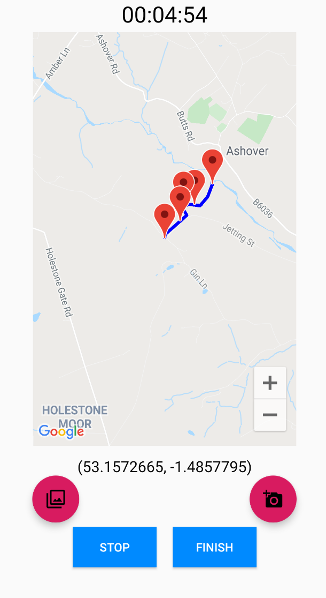
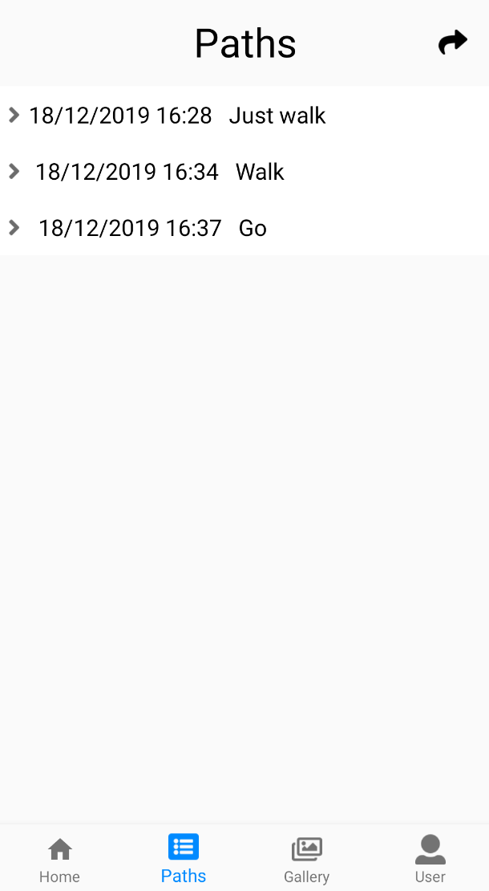
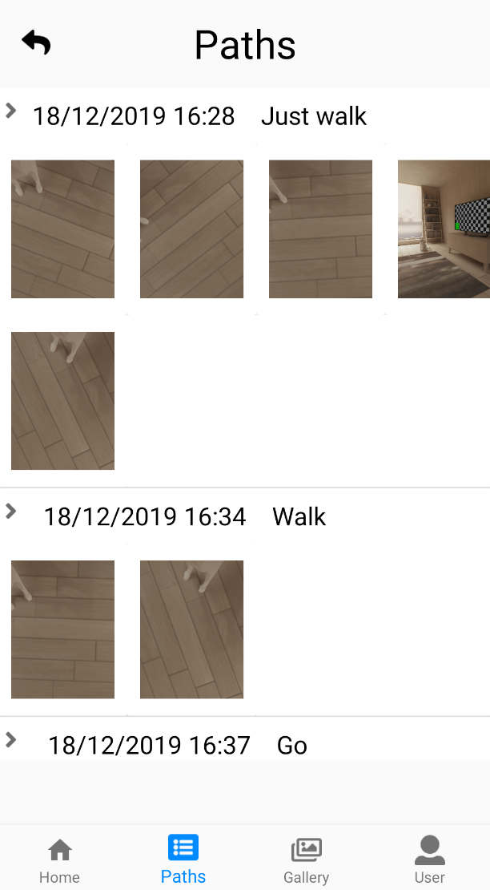
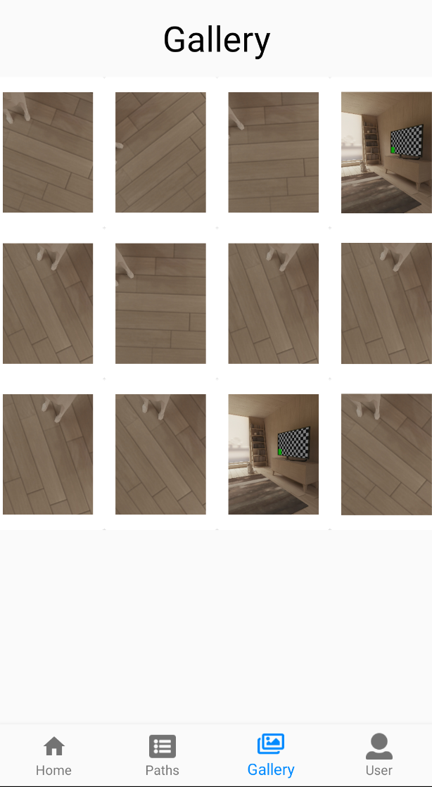
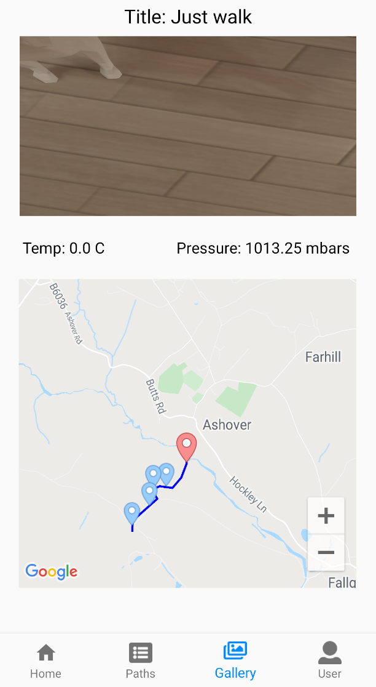
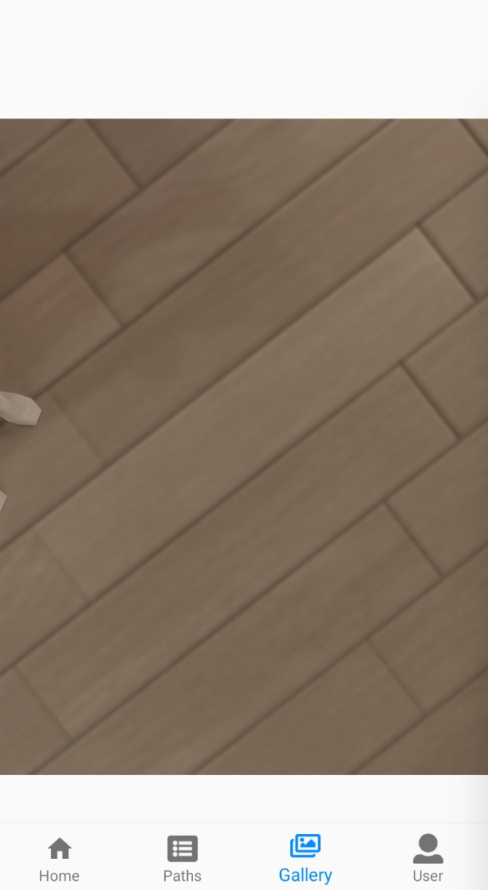
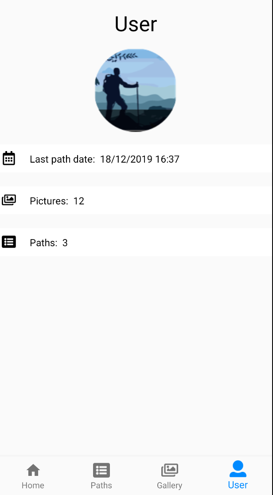

# **Software Development for Mobile Devices**

## **Scenario**

The learning objectives of the assignment are to learn:

* to build an app with a flexible sophisticated layout

* to use separation of concerns (using MVVM)

* to cope with multimedia data

* to store data locally using abstractions of databases (Room)

* to use the phone's sensors (GPS, barometric pressure, etc.)

* to use background services

* to work as a group

## **Functionalities**

### **Taking and uploading Pictures**

The app must allow taking pictures using the camera. This functionality must be working both when used on a real device and on the emulator.

### **Capturing a visit**

The app should allow capturing a geolocated visiting path, i.e. an activity over a limited period of time when the app tracks location, temperature and barometric pressure at regular intervals (20 seconds). 

### **Persisting data in a local database**

All the data captured during the visit (title, date, description, GPS coordinates, sensor data, etc.) must be saved in a local database implemented using Room (i.e. not directly using SQLite), so that it can be retrieved at a later stage.

The database must allow searching of images and visits as explained below. Note that you must implement an aSync process retrieval, as accessing a database on the UI Thread is not allowed.

### **Visually browse previews of photos**

The user must be able to browse all the pictures taken or uploaded to the app. In doing so must design and implement an original program that:

* Allows visualising previews of the pictures

* Allows selecting a picture for further detailed inspection

It is important that the interface is efficient and able to cope with a library of thousands of photos.

### **Inspecting the details of a photo**

Tapping on a photo in the browsing interface should allow inspecting the details of that specific photo by tapping on it. In this case the photo must be shown together with the following data:

* A larger version of the photo (if clicked it should sow the full size photo)

* Path title

* Last available sensor readings at time of taking the picture (barometric pressure and temperature recorded from the phone’s sensors)

* Location on map (in red in the example) with full path displaying trhe location of other pics
taken on the same path (in blue in the example)

## **ScreenShots**

### **Home**

### **Paths**

### **Gallery**

### **User**

